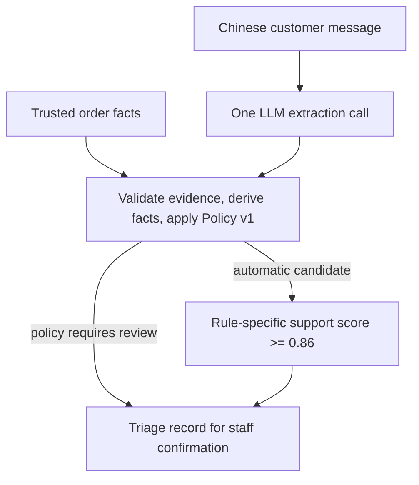

# ReturnGuard

ReturnGuard helps an apparel customer-service agent triage a Simplified Chinese return request into **eligible**, **ineligible** or **manual_review**, with inspectable evidence and a policy rule ID. One LLM call extracts facts; deterministic code validates them and applies a versioned project policy. Staff confirm the recommendation. The prototype does not issue refunds or act on an order.

**Status:** the frozen 180-case synthetic benchmark and formal dev/test evaluation are complete. The provisional threshold is locked at **0.86**. Recorded held-out results are final; the current entry point supports offline inspection and deterministic replay.

## Problem and persona

A support agent receives informal messages that mix return reasons, item condition, uncertain statements and irrelevant details. Reading every message against a policy is repetitive, while automatically accepting a guessed condition is risky. ReturnGuard supplies a consistent first-pass route, Chinese evidence spans and an explicit review reason when automation should stop.

The scope is one online apparel item and one simplified project policy, including a 14-day brand goodwill extension. It is not a complete real retailer policy.

## Input and output

Input has a Chinese message and trusted order facts. Dates and custom-made status come from the order record, not the model's interpretation:

```json
{
  "customer_message": "尺码不合适想退，吊牌还在，没脏没破，只试穿了一下。",
  "order_facts": {
    "receipt_date": "2026-06-02",
    "request_date": "2026-06-05",
    "is_custom_made": false
  }
}
```

The output contains four extracted values (`return_reason`, `tag_status`, `damage_or_stain`, `use_beyond_inspection`), verbatim Chinese evidence, field support scores, derived calendar days/item condition, a candidate route and rule ID, the final route, and any review reason. Eligible/ineligible are triage recommendations; manual review preserves uncertainty or policy-required escalation. See the [schemas](src/returnguard/schemas.py) and [recorded test example](results/phase3/test_cases/test_001.json).

## Architecture and transformation



1. The model receives only the Chinese message under [extraction_v1](prompts/extraction_v1.md), with a strict four-field JSON schema and no tools. Order facts, English annotations, gold labels, IDs and split metadata are excluded from model input.
2. [Validation](src/returnguard/validation.py) checks the schema and exact evidence spans. Code derives condition and elapsed calendar days, then [Policy v1](policies/policy_v1.json) applies ordered rules. Quality/fulfillment disputes and some missing or conflicting facts require review according to those rules.
3. For an automatic candidate, [acceptance](src/returnguard/acceptance.py) aggregates support from fields relevant to that rule. It accepts at `score >= 0.86`; a lower score becomes manual review. Policy-required manual routes bypass that threshold. Validation and exhausted infrastructure failures also yield review in their respective execution paths.

Support scores are self-assessments for ranking/abstention, not calibrated probabilities. The LLM extracts facts; it does not choose the final policy route.

## TA quick start: offline, no API key

Use Python 3.11+ from the repository root. Python 3.11 was used for formal evaluation. Install project dependencies and the recorded dependency versions:

```bash
python -m venv .venv
. .venv/bin/activate
python -m pip install -r requirements.txt
python -m pip install -r results/phase3/requirements_lock.txt
python -m pytest -q
python scripts/sanitize_phase3_public.py verify-public
python scripts/generate_blueprints.py --check
```

On Windows, activate with `.venv\Scripts\activate`. These checks use fixtures or stored artifacts, make no model calls, and do not rewrite the benchmark or results. The suite includes deterministic pipeline and recorded UI tests. `verify-public` validates published evaluation hashes; `--check` verifies existing blueprints without generating replacements.

### Local Streamlit Recorded Demo

With the virtual environment active, start the one-page demo from the repository root:

```bash
python -m streamlit run demo_app.py --server.address 127.0.0.1 --server.headless true --browser.gatherUsageStats false
```

Open <http://127.0.0.1:8501>, choose an example, and click **Replay recorded case**. **Recorded Demo** is offline replay, not a new model call. It uses the saved extractions for `test_001` (eligible), `test_031` (ineligible) and `test_061` (manual review), then calls the existing `run_case` pipeline at the locked threshold **0.86** and checks the replay against the frozen result. Inputs are read-only. The page shows the customer message, order facts, final route, matched rule, four extracted fields with exact Chinese evidence, support score and review reason. Policy-required manual review has an **N/A** support score because it bypasses the threshold.

This minimal version has no Live Mode and makes no model calls, even when an API key is present. It writes no evaluation artifacts. Stop the local server with `Ctrl+C`.

### Replay one recorded case through the product logic

With the virtual environment active, run this from the repository root. It injects a saved extraction into `run_case`, verifies recorded routing/support fields, and prints a triage record without writing results:

```bash
PYTHONPATH=src python - <<'PY'
import json
from pathlib import Path
from returnguard.extractor import ExtractionResponse
from returnguard.pipeline import run_case
from returnguard.policy import Policy

inputs = [json.loads(line) for line in Path("results/phase3/test_inputs.jsonl").read_text(encoding="utf-8").splitlines()]
case = next(row for row in inputs if row["case_id"] == "test_001")
saved = json.loads(Path("results/phase3/test_cases/test_001.json").read_text(encoding="utf-8"))

class StoredExtractor:
    def extract(self, message):
        assert message == case["input"]["customer_message"]
        return ExtractionResponse(raw=saved["raw_structured_extraction"], model_name=saved["model_name"])

replayed = run_case(case["input"], StoredExtractor(), Policy(), case_id=case["case_id"], threshold=0.86)
keys = ("final_route", "candidate_rule_id", "review_reason", "case_support_score")
assert all(replayed[key] == saved[key] for key in keys)
print(json.dumps({key: replayed[key] for key in keys}, ensure_ascii=False, indent=2))
PY
```

Expected: `eligible`, `EL01_7DAY`, `review_reason: null`, score `0.96`. In PowerShell, set `$env:PYTHONPATH = "src"` and pass the Python block as a here-string to `python`; the heredoc above is bash syntax.

Replay and fixture tests exercise deterministic logic; they are not new model evaluation. `run_smoke.py`, generation scripts and formal inference/scoring workflows are historical experiment tooling, outside this quick start. Formal evaluation is closed; do not execute new dev/test model calls or regenerate its results.

## Metrics targeted and reached

The predefined targets were **>=90% selective accuracy**, **>=60% coverage**, and **>=+10 percentage points of coverage over the fixed baseline when both meet the accuracy constraint**. The comparison uses the predefined point-estimate constraint, not an interval lower-bound rule.

| Frozen 90-case held-out result | ReturnGuard | Locked Keyword+Rules |
|---|---:|---:|
| Coverage: automatic routes / all cases | 57/90 (63.33%) | 26/90 (28.89%) |
| Selective accuracy: correct / automatic routes | 57/57 (100%) | 25/26 (96.15%) |
| Manual-review recall | 30/30 (100%) | 29/30 (96.67%) |
| Three-class final route accuracy | 87/90 (96.67%) | 54/90 (60%) |
| Gold-manual cases routed automatically | 0 | 1 |

All three predefined targets were met; safe coverage gain was **+34.44 percentage points**. Manual-review recall is an additional reported safety diagnostic. Selective accuracy covers accepted automatic routes, not all requests or all extracted fields. [Evaluation definitions, intervals and artifacts](results/README.md) give the full interpretation.

## Limitations

- The benchmark is **small, balanced and synthetic**: 90 dev and 90 test cases, with 30 per gold route in each split. It does not estimate real traffic, workload savings or production reliability.
- Threshold **0.86 is provisional**, selected on 90 dev cases. Test support-score error capture is **1/1** erroneous automatic candidate; two correct candidates were also withheld. This is limited evidence for general error ranking or calibration.
- Four test cases had extraction-value errors; all-four-field exact accuracy was 86/90. A correct final route can coexist with an extraction or rule-ID error.
- The evaluated alias does not identify an immutable upstream model revision; upstream-provider metadata was unavailable. Recorded API costs are historical returned usage costs, not current price estimates.
- This is a Python triage prototype with audit records, without a deployed UI, order-system integration or refund action.

## Repository map and documentation

| Location | Purpose |
|---|---|
| [data/README.md](data/README.md) | Composition, provenance, reviews, leakage controls and freeze |
| [results/README.md](results/README.md) | Locked evaluation, metric definitions, results, uncertainty and hashes |
| [demo_app.py](demo_app.py) | One-page local Streamlit Recorded Demo using the existing pipeline |
| [pipeline.py](src/returnguard/pipeline.py) | Connect extraction, validation, policy and acceptance |
| [extractor.py](src/returnguard/extractor.py), [schemas.py](src/returnguard/schemas.py) | Model adapter and structured contracts |
| [validation.py](src/returnguard/validation.py), [policy.py](src/returnguard/policy.py), [acceptance.py](src/returnguard/acceptance.py) | Evidence checks, derived facts, ordered rules and support gate |
| [keyword_baseline.py](src/returnguard/keyword_baseline.py), [baselines/](baselines/) | Locked conservative comparator |
| [eval_metrics.py](src/returnguard/eval_metrics.py), [formal_eval.py](src/returnguard/formal_eval.py), [heldout_scoring.py](src/returnguard/heldout_scoring.py) | Metrics, historical inference guards and separate scoring |
| [scripts/](scripts/), [tests/](tests/) | Offline checks, historical experiment tools and fixture tests |
| [policies/](policies/), [prompts/](prompts/) | Versioned policy and extraction/generation instructions |
| [docs/](docs/) | Historical handoffs, formal specification and publication notes |

Start with the current data/results explainers. Older handoffs retain phase-time pending-approval statements as provenance; the frozen dataset and closed evaluation supersede those statuses. The course report and demo script are separate deliverables awaiting the next review.
